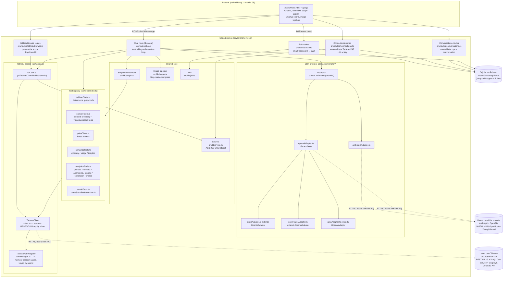
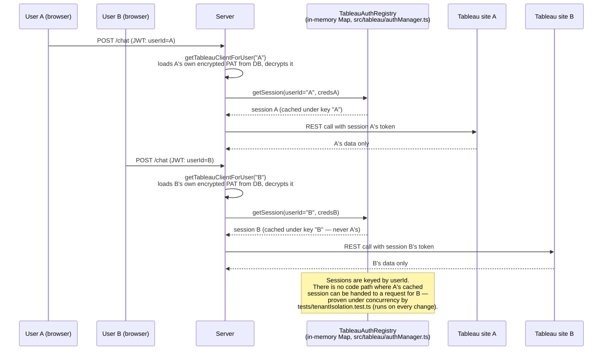
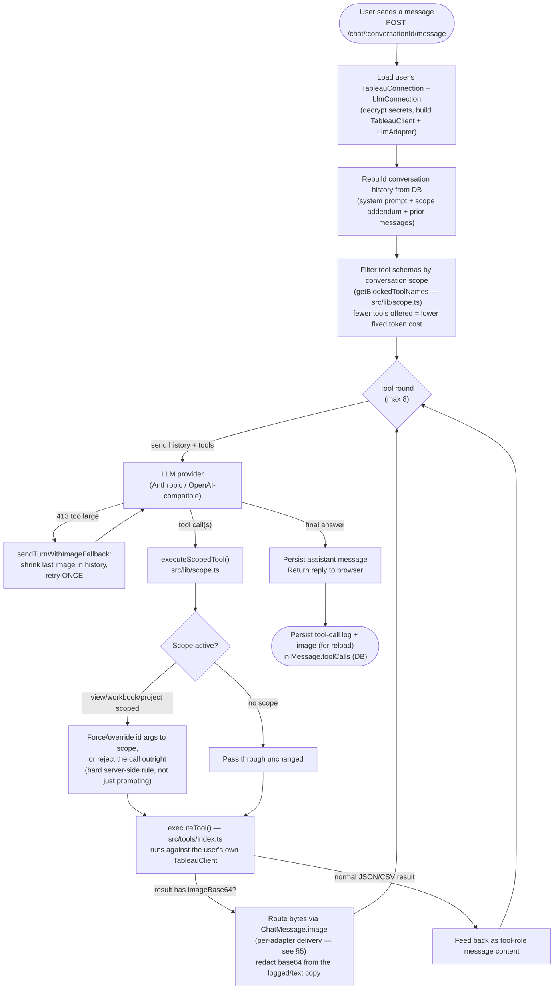
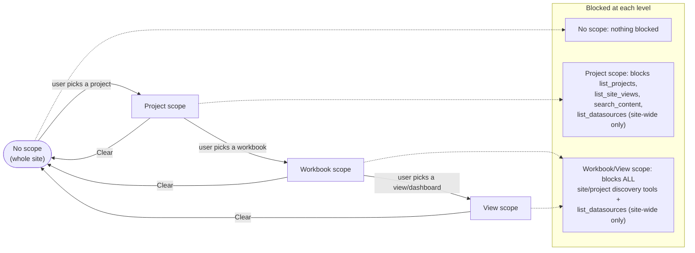
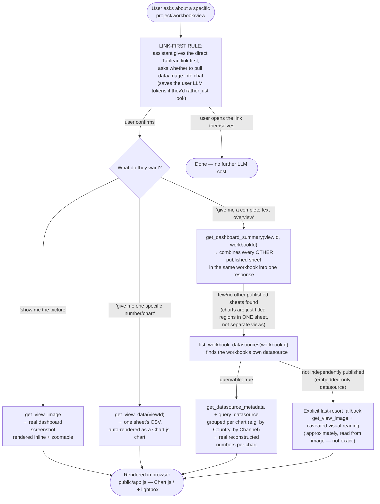
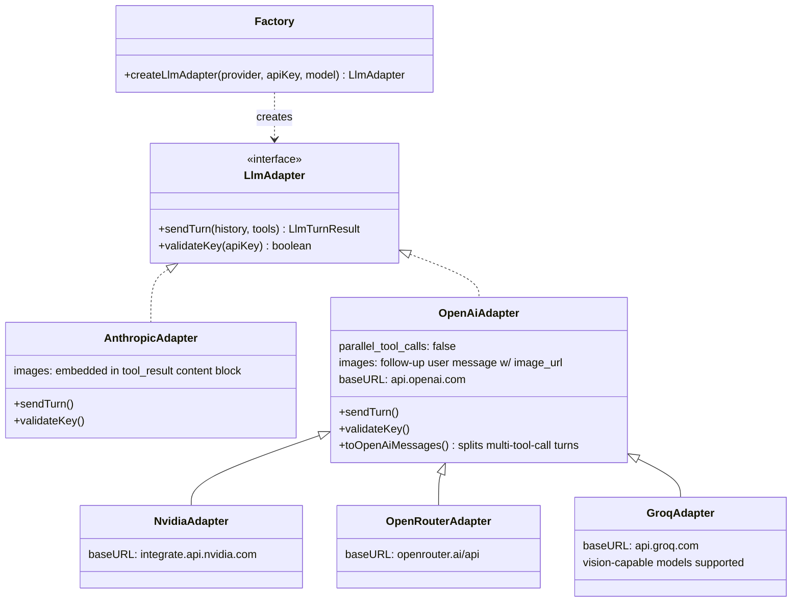
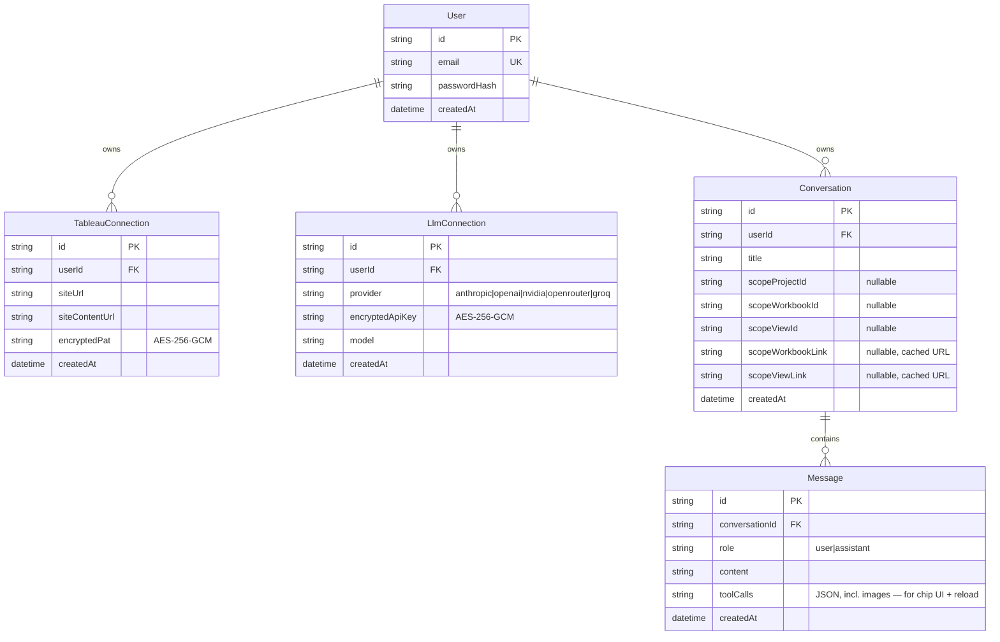
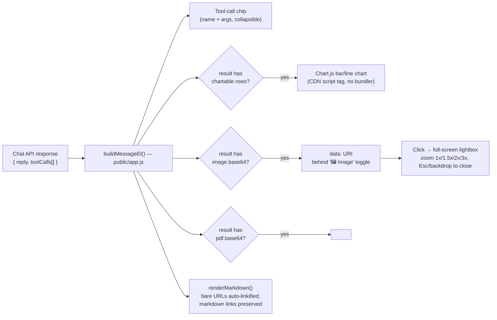

# Lumen — Platform Architecture (Stakeholder Reference)

BYOK (Bring Your Own Key) multi-tenant conversational analytics platform for
Tableau. Users connect their own Tableau Cloud site (via a Personal Access
Token) and their own LLM provider API key, then chat in natural language;
the LLM answers by calling tools scoped strictly to that user's own Tableau
data. Every diagram below reflects the current implementation, not a future
plan — file paths are included so any claim here can be checked against the
code directly.

---

## 1. System overview



**Read this as:** nothing about a user's Tableau data or LLM key is shared
infrastructure — every arrow into Tableau or an LLM provider carries that
specific user's own credentials, constructed fresh per-request from
`forUser.ts`.

---

## 2. Tenant isolation (the non-negotiable guarantee)



Additional isolation guarantees enforced at the data layer:
- Every Prisma query for connections/conversations/messages is scoped with
  `where: { userId }` — confirmed in `connections.ts`, `conversations.ts`,
  `chat.ts`.
- Secrets (`TableauConnection.encryptedPat`, `LlmConnection.encryptedApiKey`)
  are AES-256-GCM encrypted at rest (`src/lib/crypto.ts`) and only decrypted
  in-memory, per-request, for that row's own owning user.

---

## 3. Chat message lifecycle (the orchestration loop)



Key correctness properties:
- **Max 8 rounds** — bounds cost and prevents infinite tool-call loops.
- **One tool call per round** on OpenAI-compatible providers
  (`parallel_tool_calls: false`) — several free-tier models reject
  multi-call responses outright.
- **Scope enforcement is server-side**, not just prompted — a scoped
  conversation cannot reach another view/workbook/project's data even if the
  model tries, because `executeScopedTool` rewrites or rejects the call
  before it reaches Tableau.
- A provider error (network, 429, 413, 401…) is caught, logged safely
  (no secrets), turned into a friendly message, and returns HTTP 502 — it
  never crashes the Node process.

---

## 4. Drill-down scope (Project → Workbook → View)



Stored on the `Conversation` row (`prisma/schema.prisma`):
`scopeProjectId/Name`, `scopeWorkbookId/Name/Link`,
`scopeViewId/Name/Link` — nullable, cascading (clearing a workbook clears
its view too). The `...Link` fields cache the direct Tableau URL at
selection time so the "offer the link first" behavior (§6) never needs an
extra lookup.

---

## 5. Image pipeline (`get_view_image` / `get_dashboard_summary` fallback)

```mermaid
sequenceDiagram
    participant Model as LLM
    participant Chat as chat.ts
    participant Tool as contentTools.ts
    participant Tableau as Tableau REST API
    participant Jimp as image.ts (Jimp)
    participant Browser

    Model->>Chat: tool_call get_view_image(viewId)
    Chat->>Tool: executeScopedTool → getViewImage()
    Tool->>Tableau: GET /views/{viewId}/image?resolution=...
    Tableau-->>Tool: raw PNG (full dashboard composite)
    Tool->>Jimp: resizeAndCompress(png, 700px, quality 55)
    Jimp-->>Tool: compressed JPEG buffer
    Tool-->>Chat: { mediaType, imageBase64, sizeBytes }

    Chat->>Chat: extract imageBase64 into ChatMessage.image;<br/>redact it from the text copy sent back to the model as a tool result
    Chat->>Model: image delivered per-adapter:<br/>Anthropic → tool_result content block<br/>OpenAI-compatible → follow-up user message w/ image_url

    alt Provider rejects as 413 (too large)
        Chat->>Jimp: resizeAndCompress(same image, 450px, quality 35)
        Chat->>Model: retry ONCE with smaller image
    end

    Chat->>Browser: responseToolCalls (with image) + persisted to DB<br/>(Message.toolCalls JSON — survives page reload)
    Browser->>Browser: render  behind "🖼️ Image" toggle;<br/>click to open zoomable lightbox (1x→1.5x→2x→3x)
```

**Why the image is compressed so aggressively:** some BYOK providers (seen
in practice: Groq's free tier) enforce an ~8000 tokens-per-minute limit that
a raw dashboard PNG blows through instantly once combined with system
prompt + tool schemas. The compression pipeline plus the 413 auto-retry
exist specifically to keep image-based questions working within that
constraint without the user needing to know about it.

---

## 6. The three ways a user can inspect one dashboard



This chain exists because of a genuine Tableau REST API limitation: there is
**no endpoint that returns a whole dashboard's combined data in one call**.
Each fallback step is a progressively-less-precise workaround for that gap,
and the system prompt (`src/routes/chat.ts`) instructs the model to try them
in this exact order rather than giving up after the first miss.

---

## 7. LLM provider abstraction



**Adding a 6th provider is a small, contained change:** one new adapter file
(often just a `baseURL` override on `OpenAiAdapter`, as NVIDIA/OpenRouter/Groq
already are) plus one new `case` in `src/llm/factory.ts`. Nothing else in the
codebase needs to know a new provider exists.

---

## 8. Data model



`POST /connections/tableau` and `/connections/llm` replace (delete +
create, in one transaction) rather than accumulate, so exactly one
connection of each type exists per user at any time — this closed a real bug
where stale duplicate connections were silently reused.

---

## 9. Full tool catalog (64 tools, 6 modules)

```mermaid
flowchart LR
    subgraph Discovery["Discovery — no id required"]
        d1[list_projects]
        d2[list_workbooks]
        d3[list_flows]
        d4[list_virtual_connections]
        d5[list_site_views]
        d6[search_content]
        d7[list_datasources]
        d8[list_pulse_metrics]
        d9[list_users]
        d10[search_fields]
    end

    subgraph Detail["Detail — requires a real id from Discovery"]
        v1["list_workbook_views(workbookId)"]
        v2["get_view_data(viewId)"]
        v3["get_view_image(viewId)"]
        v4["get_dashboard_summary(viewId, workbookId)"]
        v5["list_workbook_datasources(workbookId)"]
        v6["get_datasource_metadata(datasourceLuid)"]
        v7["query_datasource(datasourceLuid)"]
        v8["get_field_values(datasourceLuid)"]
        v9["get_pulse_metric_insight(definitionId)"]
        v10["check_permissions(contentId)"]
        v11["refresh_extract_status(datasourceId)"]
        v12["get_dashboard_insights(viewId)"]
        v13["get_datasource_glossary(datasourceLuid)"]
        v14["get_field_usage(datasourceLuid)"]
        v15["get_metric_definition(definitionId)"]
    end

    subgraph Analytical["Analytical — datasourceLuid, resolved from the above"]
        a1["compare_periods(datasourceLuid)"]
        a2["explain_change(datasourceLuid)"]
        a3["anomaly_detection(datasourceLuid)"]
        a4["forecast_metric(datasourceLuid)"]
        a5["get_metric_history(definitionId)"]
        a6["get_data_quality_warnings(datasourceLuid)"]
        a7["get_field_lineage(datasourceLuid)"]
        a8["cross_datasource_query(datasourceLuids)"]
        a9["rank_categories(datasourceLuid)"]
        a10["pivot_cross_tab(datasourceLuid)"]
        a11["rollup_time_series(datasourceLuid)"]
        a12["correlation_analysis(datasourceLuid)"]
        a13["field_statistics(datasourceLuid)"]
        a14["bucketize_metric(datasourceLuid)"]
        a15["share_of_total(datasourceLuid)"]
        a16["get_summary_table(datasourceLuid)"]
    end

    subgraph ContentAdmin["Content & admin — REST, ids from Discovery/Detail"]
        c1["get_workbook_details(workbookId)"]
        c2["get_workbook_thumbnail(workbookId)"]
        c3["get_view_pdf(viewId)"]
        c4["list_workbook_revisions(workbookId)"]
        c5["list_tags(workbookId)"]
        c6["add_tags(workbookId, tags)"]
        c7["remove_tags(workbookId, tag)"]
        c8["list_favorites(userId?)"]
        c9["add_favorite(contentType, contentId)"]
        c10["remove_favorite(contentType, contentId)"]
        c11["list_custom_views(workbookId?)"]
        c12["get_custom_view_image(customViewId)"]
        c13["get_data_quality_warning(contentType, contentId)"]
        c14["query_workbook_permissions(workbookId)"]
        c15["query_view_permissions(viewId)"]
        c16["query_datasource_permissions(datasourceId)"]
        c17["list_subscriptions"]
        c18["list_data_driven_alerts"]
        c19["list_schedules"]
        c20["list_groups"]
        c21["get_group_members(groupId)"]
        c22["get_server_info"]
    end

    d1 --> v1
    d2 --> v1
    d6 --> v1
    d7 --> v6
    d5 --> v4
    v1 --> v2
    v1 --> v3
    v2 --> v4
    v5 --> v6
    v6 --> v7
    v7 --> v8
    v6 --> a1
    v6 --> a3
    v6 --> a4
    v6 --> a6
    v6 --> a7
    v6 --> a9
    v6 --> a10
    v6 --> a11
    v6 --> a12
    v6 --> a13
    v6 --> a14
    v6 --> a15
    v6 --> a16
    d10 --> v6
    a8 --> v6
    d2 --> c1
    d2 --> c2
    d2 --> c4
    d2 --> c5
    d2 --> c6
    d2 --> c7
    d2 --> c14
    v1 --> c3
    v1 --> c15
    v1 --> c11
    c11 --> c12
    d7 --> c16
    d1 --> c20
    c20 --> c21
```



| Tool | Module | Purpose |
|---|---|---|
| `list_projects` | contentTools.ts | List projects (folders), paginated |
| `list_workbooks` | contentTools.ts | List workbooks, filterable by project/name |
| `list_flows` | contentTools.ts | List Tableau Prep flows |
| `list_virtual_connections` | contentTools.ts | List virtual connections |
| `search_content` | contentTools.ts | One-call search across workbooks/datasources/flows/projects |
| `list_workbook_views` | contentTools.ts | Views (sheets/dashboards) inside one workbook |
| `list_site_views` | contentTools.ts | Every view site-wide in one call (avoids N+1 looping) |
| `get_view_data` | contentTools.ts | One view's underlying data as CSV |
| `get_view_image` | contentTools.ts | Rendered dashboard screenshot (resized/compressed JPEG) |
| `get_dashboard_summary` | contentTools.ts | Combines every other sheet in a dashboard's workbook into one text overview |
| `list_datasources` | tableauTools.ts | Site-wide published datasources |
| `list_workbook_datasources` | tableauTools.ts | The specific datasource(s) behind one workbook |
| `get_datasource_metadata` | tableauTools.ts | Fields/types available in a datasource (GraphQL Metadata API) |
| `query_datasource` | tableauTools.ts | Aggregate/filter/sort query against a datasource (VizQL Data Service) |
| `get_field_values` | tableauTools.ts | Distinct values for one field |
| `list_pulse_metrics` | pulseTools.ts | Tableau Pulse metrics |
| `get_pulse_metric_insight` | pulseTools.ts | Insight detail for one Pulse metric |
| `get_datasource_glossary` | semanticTools.ts | Field glossary — captions, types, roles, descriptions, formulas |
| `get_field_usage` | semanticTools.ts | Which sheets/workbooks reference a field |
| `get_metric_definition` | semanticTools.ts | Resolves a Pulse metric's formula (e.g. SUM(Revenue)) |
| `get_dashboard_insights` | semanticTools.ts | Computed stats (min/max/avg/sum, top values) from a view's data |
| `recommend_visualization` | semanticTools.ts | Chart-type advice from field roles (pure logic, no Tableau call) |
| `compare_periods` | analyticalTools.ts | Diff a measure between two date windows (overall + per-dimension, % change) |
| `explain_change` | analyticalTools.ts | compare_periods + ranked "drivers" of the change (attribution) |
| `anomaly_detection` | analyticalTools.ts | Z-score outliers in a time-bucketed series |
| `forecast_metric` | analyticalTools.ts | Least-squares linear forecast with ±1σ confidence band |
| `get_metric_history` | analyticalTools.ts | A Pulse metric's value over time (resolved from its own spec) |
| `get_data_quality_warnings` | analyticalTools.ts | Data-quality warnings on a datasource + fields |
| `get_field_lineage` | analyticalTools.ts | Upstream source columns + downstream sheets for a field |
| `search_fields` | analyticalTools.ts | Site-wide field-name search (Metadata API searchFields) |
| `cross_datasource_query` | analyticalTools.ts | One measure across several datasources, merged with a grand total |
| `rank_categories` | analyticalTools.ts | Top/bottom N members by measure, with % of total + cumulative share |
| `pivot_cross_tab` | analyticalTools.ts | Rows x columns matrix for a measure with row/column totals |
| `rollup_time_series` | analyticalTools.ts | A measure bucketed to day/week/month/quarter/year, sorted |
| `correlation_analysis` | analyticalTools.ts | Pearson + Spearman correlation between two measures |
| `field_statistics` | analyticalTools.ts | min/max/avg/median from VDS + sampled null%/cardinality/percentiles |
| `bucketize_metric` | analyticalTools.ts | Client-side equal-width histogram bins for a measure |
| `share_of_total` | analyticalTools.ts | Each member's share + cumulative %, with a baseline share delta |
| `get_summary_table` | analyticalTools.ts | One-call insights digest: total, monthly trend, top contributor |
| `list_users` | adminTools.ts | Site users (admin-gated by Tableau itself) |
| `check_permissions` | adminTools.ts | Permission check for a datasource, workbook, or view |
| `refresh_extract_status` | adminTools.ts | Extract refresh status for a datasource |
| `get_workbook_details` | contentTools.ts | Workbook metadata — description, project, owner, size, tags, link |
| `get_workbook_thumbnail` | contentTools.ts | Workbook preview image (resized/compressed JPEG) |
| `get_view_pdf` | contentTools.ts | PDF export of a view — embed + download in the chat, never routed to the model |
| `list_workbook_revisions` | contentTools.ts | Revision history for a workbook (number, time, author) |
| `list_tags` | contentTools.ts | Tags on a workbook |
| `add_tags` | contentTools.ts | PUT tags onto a workbook (write tool — executes immediately) |
| `remove_tags` | contentTools.ts | DELETE a tag from a workbook (write tool) |
| `list_favorites` | contentTools.ts | A user's favorites grouped by type (defaults to the signed-in user) |
| `add_favorite` | contentTools.ts | Favorite a workbook/view/datasource/flow (write tool) |
| `remove_favorite` | contentTools.ts | Un-favorite a workbook/view/datasource/flow (write tool) |
| `list_custom_views` | contentTools.ts | Custom views site-wide, optionally filtered by workbook |
| `get_custom_view_image` | contentTools.ts | A custom view's preview image (resized/compressed JPEG) |
| `get_data_quality_warning` | contentTools.ts | Data-quality warnings on a workbook/datasource/flow |
| `query_workbook_permissions` | adminTools.ts | Per-user/group capabilities on a workbook |
| `query_view_permissions` | adminTools.ts | Per-user/group capabilities on a view |
| `query_datasource_permissions` | adminTools.ts | Per-user/group capabilities on a datasource |
| `list_subscriptions` | adminTools.ts | Email subscriptions on the site (subject, schedule, content, user) |
| `list_data_driven_alerts` | adminTools.ts | Data-driven alerts on the site (metric, creator, subject) |
| `list_schedules` | adminTools.ts | Extract-refresh/subscription schedules with frequency + next run |
| `list_groups` | adminTools.ts | Groups on the site with their default role |
| `get_group_members` | adminTools.ts | Users in a specific group |
| `get_server_info` | adminTools.ts | Tableau product/version/build/REST API version (cheap diagnostic) |

---

## 10. Frontend rendering (no build step)



Deliberate constraint: **no React, no bundler.** Every interactive piece
(charts, image toggle, lightbox, scope dropdowns) is built with plain DOM
APIs in `public/app.js`, loaded directly via `<script>` tags in
`index.html`.

---

## 11. What's stubbed for this MVP vs. production

| Area | MVP (today) | Production path |
|---|---|---|
| Tableau auth | Pasted Personal Access Token | Full Tableau OAuth (Connected App) flow |
| Database | SQLite | Postgres — one line in `schema.prisma` |
| Tableau session cache | In-memory `Map` per process | Redis (survives restarts, works across instances) |
| Secrets encryption | AES-256-GCM, env-configured key | KMS-backed envelope encryption (`crypto.ts` is a 1-file swap point) |
| Platform auth | Email + password, JWT session | SSO / OIDC |
| Tool access control | All 64 tools available to every connected account | Fine-grained per-user tool enablement (e.g. hide admin tools from non-admins) |
| Rate limiting / billing | In-memory per-user token-bucket limits (`rateLimit.ts`) on `/chat` + `/connections/llm`; `ToolUsage`/`LlmUsage` metering (truncated args, estimated cost) + `GET /usage` + `GET /usage/summary` + frontend usage modal | Redis-backed limits, real billing/quotas tied to metered usage |
| Data retention | Tool results persisted only as long as conversation history needs them | Explicit retention policy |

---

*Generated from the codebase as of the current state of `src/`, `prisma/schema.prisma`, and `public/`. Re-generate after significant architecture changes (new provider, new tool, new scope level) to keep this accurate.*
